<div align="center">

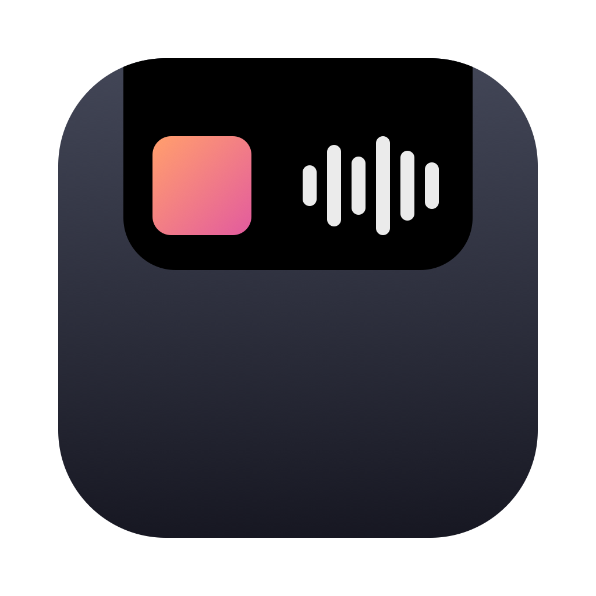

# NotchPlayer

**Spotify now-playing, in the MacBook notch.**

[](https://www.apple.com/macos/)
[](https://swift.org)
[](LICENSE)
[](https://github.com/arvxanand/NotchPlayer/releases)
[](https://github.com/arvxanand/NotchPlayer/releases)

</div>

<div align="center">

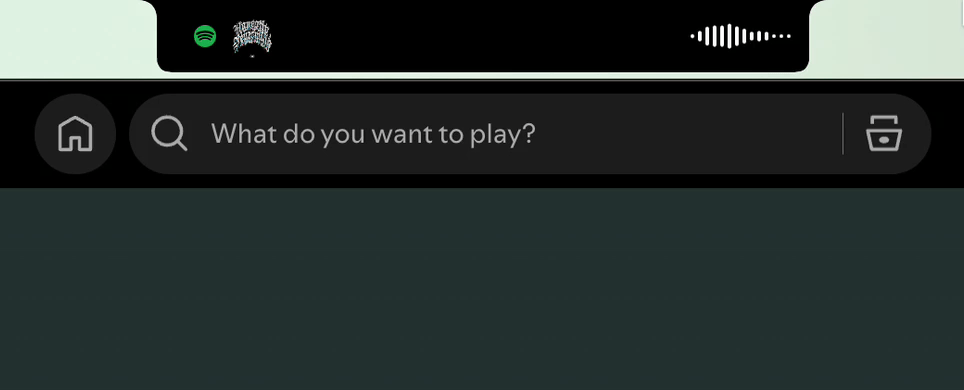

</div>

---

Collapsed, while music plays: the album cover and a live waveform — a real FFT
of Spotify's own audio — either side of the camera housing. Hover the cutout
and it expands into a panel with the cover, the track, a progress bar you can
drag to seek, and the transport row. Idle, it draws nothing and the notch looks
like a notch.

No login and no Spotify developer account. The only network calls are the
album cover, and Spotify's public page for a song when you click its title or
artist. Swift 6 / SwiftUI + AppKit, zero third-party dependencies.

## Features

<table>
<tr>
<td width="50%">

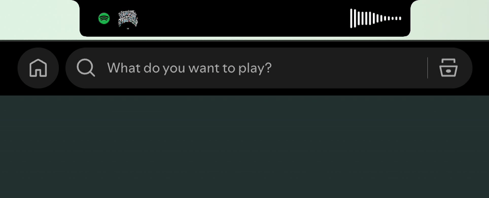

</td>
<td width="50%">

### Now playing, at a glance

The cover on one side of the camera housing, a live waveform on the other.
The waveform is a real FFT of Spotify's output through a Core Audio process
tap — 14 bars, computed in memory, never stored and never sent anywhere.

</td>
</tr>
<tr>
<td width="50%">

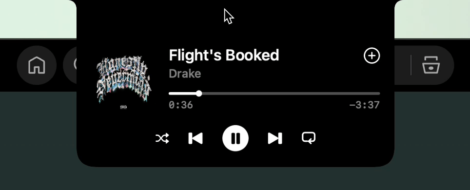

</td>
<td width="50%">

### Full transport

Play/pause, previous, next, and a progress bar you can click or drag to seek —
the target is the 30pt band around the line, not the line itself. Shuffle and
repeat sit in the same row; repeat cycles off → all → one, and NotchPlayer
loops the song itself for "one".

</td>
</tr>
<tr>
<td width="50%">

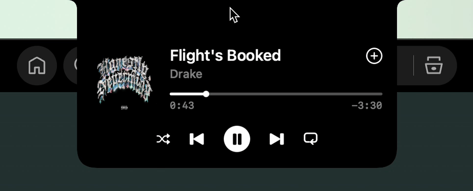

</td>
<td width="50%">

### Save the song

The **+** at the end of the title row. By default it opens the song in Spotify
so you can add it there. Turn on **Save with Spotify's +** and it presses
Spotify's own + for you — unsaved goes straight to Liked Songs, already-saved
opens the playlist picker.

</td>
</tr>
<tr>
<td width="50%">

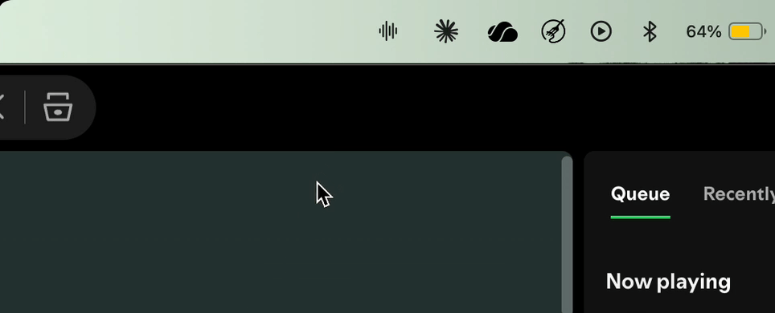

</td>
<td width="50%">

### Stays out of the way

A waveform glyph in the menu bar is the only other control: what's playing,
**Hide from the Notch** (stands the app fully down — no panel, no hover
polling, no audio tap), and Quit. The gear opens settings: launch at login,
cover colour on the progress bar, and the + behaviour.

</td>
</tr>
</table>

## Install

You need:

- a MacBook with a notch (every one of them is Apple Silicon)
- macOS 15 Sequoia or later
- the Spotify desktop app, signed in

### 1. Download it

**[Download NotchPlayer](https://github.com/arvxanand/NotchPlayer/releases/latest/download/NotchPlayer.dmg)**,
open the file, and drag **NotchPlayer** onto the **Applications** folder next to it.

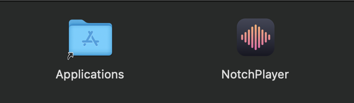

### 2. Open it the first time

macOS warns you the first time you open NotchPlayer. That's expected. Apple
only vouches for apps whose developers pay for an Apple Developer account,
and this is a free, open-source project without one. You do this once per
download.

1. Open **NotchPlayer** from your Applications folder. macOS says it couldn't
   verify it. Click **Done** (not Move to Trash).

   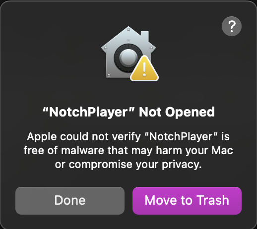

2. Open **System Settings** → **Privacy & Security**, scroll down to
   **Security**, and click **Open Anyway** next to "NotchPlayer was blocked".

   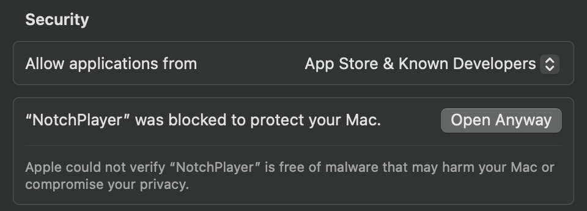

3. Click **Open Anyway** again, then enter your password or use Touch ID.

   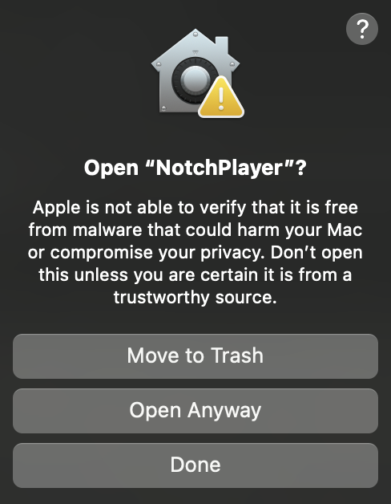

Right-clicking the app and choosing Open doesn't get past the warning on
macOS 15, so use the steps above.

#### If Open Anyway doesn't show up

1. **Try to open NotchPlayer again** from your Applications folder, and click
   **Done** when the warning appears. The Open Anyway button only shows up
   right after macOS blocks the app, and disappears again after about an hour.
2. **Go back to System Settings → Privacy & Security** and scroll all the way
   down to **Security**. If System Settings was already open, quit it first
   (**System Settings** menu → **Quit**) and open it again so it shows the
   latest.
3. **Still no button, or it asks for an administrator password you don't
   have?** Open the **Terminal** app (search for "Terminal" with Spotlight),
   paste this line, and press Return:

   ```bash
   xattr -dr com.apple.quarantine /Applications/NotchPlayer.app
   ```

   It prints nothing when it works. Now open NotchPlayer again. There's no
   warning this time.

### 3. Allow what it asks for

| Permission | Why | When |
|---|---|---|
| **Automation** | read the track and send play/pause/skip to Spotify | first launch |
| **Audio Recording** | the waveform — Spotify's output only, analysed in memory | first launch |
| **Accessibility** | optional, only for pressing Spotify's own **+** | when you enable it |

Click **Allow** for both on first launch. Then turn on **Launch at Login**
from the menu bar item (the waveform) → the gear.

#### If you clicked Don't Allow, or nothing shows up

You can turn each permission on later in **System Settings → Privacy &
Security**. Quit NotchPlayer (menu bar item → Quit) and open it again
afterwards.

- **The notch says "Can't reach Spotify"**, or the menu bar item says
  "Cannot read Spotify". That's **Automation**: go to **Privacy & Security →
  Automation**, click **NotchPlayer**, and turn on **Spotify**.
- **The cover shows, but the bars don't follow the music.** That's **Audio
  Recording**: go to **Privacy & Security → Screen & System Audio
  Recording**, scroll down to **System Audio Recording Only**, and turn on
  **NotchPlayer**.

  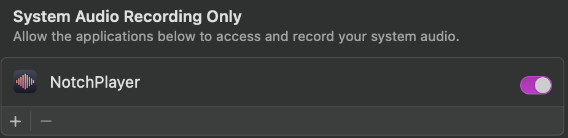

- **NotchPlayer isn't in the list at all**, so there's nothing to switch on.
  Open **Terminal**, paste this line, press Return, and open NotchPlayer
  again. It asks for everything again, and this time click **Allow**:

  ```bash
  tccutil reset All io.github.arvxanand.notchplayer
  ```

### Or install with Homebrew

If you already use [Homebrew](https://brew.sh), this puts NotchPlayer in
Applications with no warning to clear. You still allow the permissions:

```bash
brew install --cask arvxanand/notchplayer/notchplayer
```

### Updating

Quit NotchPlayer, then download the new version and drag it into
Applications again (choose **Replace**), or run
`brew upgrade --cask notchplayer`. After a download you clear the warning once
more. **Either way, macOS asks for the permissions
again after every update**, because the app isn't signed with a paid
certificate. Click Allow again.

### Uninstalling

1. Turn off **Launch at Login** (menu bar item → the gear).
2. Quit NotchPlayer (menu bar item → Quit).
3. Drag NotchPlayer from Applications to the Trash, or run
   `brew uninstall --cask notchplayer`.

That leaves its settings, cached album covers and log behind. To remove those
too, use `brew uninstall --zap --cask notchplayer` instead, or delete these
yourself (in Finder, **Go → Go to Folder…** and paste each path):

- `~/Library/Preferences/io.github.arvxanand.notchplayer.plist`
- `~/Library/Caches/NotchPlayer`
- `~/Library/Caches/io.github.arvxanand.notchplayer`
- `~/Library/HTTPStorages/io.github.arvxanand.notchplayer`
- `~/Library/Logs/NotchPlayer.log`

## Using it

Hover the notch to open the panel; move the pointer away and it closes. Click
the title, artist or cover to open that thing in Spotify — the title opens the
album with the song highlighted rather than restarting the track.

The **+** needs a word of explanation. Spotify's AppleScript dictionary exposes
a `starred` property that does nothing, so there is no scriptable way to like a
song. NotchPlayer instead presses Spotify's real + through the Accessibility
API — the same channel VoiceOver uses. It's off by default, it's your own
click being relayed, and it brings Spotify to the front. If anything is missing
— permission not granted, or a Spotify update moved the button — the + quietly
falls back to opening the song. Local files and podcasts get no +.

## For developers

### Build from source

Needs macOS 15 and **Xcode 16** (tested with 16.0, Swift 6.0). The free
Command Line Tools aren't enough yet: their Swift 6.2 didn't finish compiling
this project in over ten minutes.

```bash
git clone https://github.com/arvxanand/NotchPlayer.git
cd NotchPlayer
./tools/verify.sh              # everything checkable, in one command
./make_app.sh release          # build the bundle, restart it if running
open NotchPlayer.app
```

Quit a downloaded copy first. Both have the same bundle id, and a second copy
refuses to start while one is running.

SwiftPM can't produce a bundle, and a bundle is required for `LSUIElement`
(no dock icon), a stable bundle identifier, and the usage-description strings
TCC shows you — hence `make_app.sh` rather than plain `swift build`.

### Releasing a version

1. Tag `main` and push the tag. The version is the tag without the `v`.

   ```bash
   git tag v0.3 origin/main && git push origin v0.3
   ```

2. The `release` workflow builds `NotchPlayer.dmg` with Xcode 16.0, checks
   its signature, entitlement, version and bundle id from inside the dmg, and
   attaches it to a **draft** release, which only people with write access
   can see.
3. Download the dmg from the draft, try it, and click **Publish release**.
   The README's download link always points at the newest published release.
4. Update the cask in
   [homebrew-notchplayer](https://github.com/arvxanand/homebrew-notchplayer)
   (`Casks/notchplayer.rb`): set `version` to the new version and `sha256` to
   the value in the workflow's job summary. Until then, `brew upgrade` keeps
   installing the old one.

`tools/make-dmg.sh` makes the same dmg locally, after `./make_app.sh release`.

### When something looks wrong

```bash
swift build                            # the debug binary these use
.build/debug/NotchPlayer --read        # what Spotify is actually saying
.build/debug/NotchPlayer --watch 30    # every state change, stamped, no UI
.build/debug/NotchPlayer --list-previews
```

The waveform is the exception: the audio tap needs macOS to launch the app, or
TCC silently hands it nothing but zeros.

```bash
open --stdout /tmp/bands.txt --stderr /tmp/bands.txt \
     ./NotchPlayer.app --args --bands 8   # live bars, or "no live audio"
```

Logs go to `~/Library/Logs/NotchPlayer.log`.

### Checks

| | |
|---|---|
| `tools/verify.sh` | build, tests, notch footprint, contrast, hygiene, docs |
| `tools/check_notch.sh` | nothing legible behind the camera housing, every state. One parked window, ~17s |
| `tools/hit_probe.sh` | the play/pause and + targets are live across their whole 44pt, and only there. **Changes playback** and opens Spotify, and refuses to run while the app is up |
| `tools/frame_probe.sh` | how many frames the expand animation really renders, measured on the running app |
| `tools/sweep.sh` | no preview window or debug build left running |
| `tools/reset-permissions.sh` | make macOS re-ask for Automation, Audio Capture and Accessibility |
| `tools/make-dmg.sh` | pack `NotchPlayer.app` into `NotchPlayer.dmg`, the same way the release workflow does |
| `swift tools/make-icon.swift` | redraw the app icon (`assets/AppIcon.icns`) and the README logo |
| `tools/pixel_check.py` | assert about a window capture: `--unlit`, `--bounds` |
| `tools/crop.py` | crop and enlarge a capture so a 39pt strip can be looked at. Takes **pixels**, and captures are 2x |

`verify.sh` runs everything except `hit_probe.sh`, which clicks real buttons.

### Rebuilding the demo GIFs

The README animations are built from screen recordings that live outside git
(`recordings/` is ignored; only the built GIFs in `assets/demo/` are committed).

```bash
brew install gifski gifsicle ffmpeg
./scripts/build-all.sh              # recordings/raw/*.mov -> assets/demo/*.gif
```

Each recording is already cropped around the notch. Every GIF is 50fps and
forced under 5MB: the script gives up width first, then adds lossy
compression, then drops to 33fps, and fails loudly rather than committing
something huge. It also fails if the frame timing comes out uneven.

## Contributing

Issues and pull requests are welcome. Two things worth knowing before you open
one:

- `./tools/verify.sh` should pass. CI doesn't run it (it needs a Mac with a
  notch), so run it yourself before opening one.
- The notch is a hard constraint, not a layout suggestion. `check_notch.sh`
  exists because "looks fine on my display" has been wrong more than once.

## License

[GPL-3.0](LICENSE). You can use, modify and redistribute this, including
commercially — but if you distribute a modified version, its source has to stay
open under the same license.

NotchPlayer is not affiliated with, endorsed by, or connected to Spotify AB. It
controls the Spotify desktop app through macOS's own automation interfaces and
needs a running, signed-in Spotify client; it does not stream, download or
redistribute any audio.
